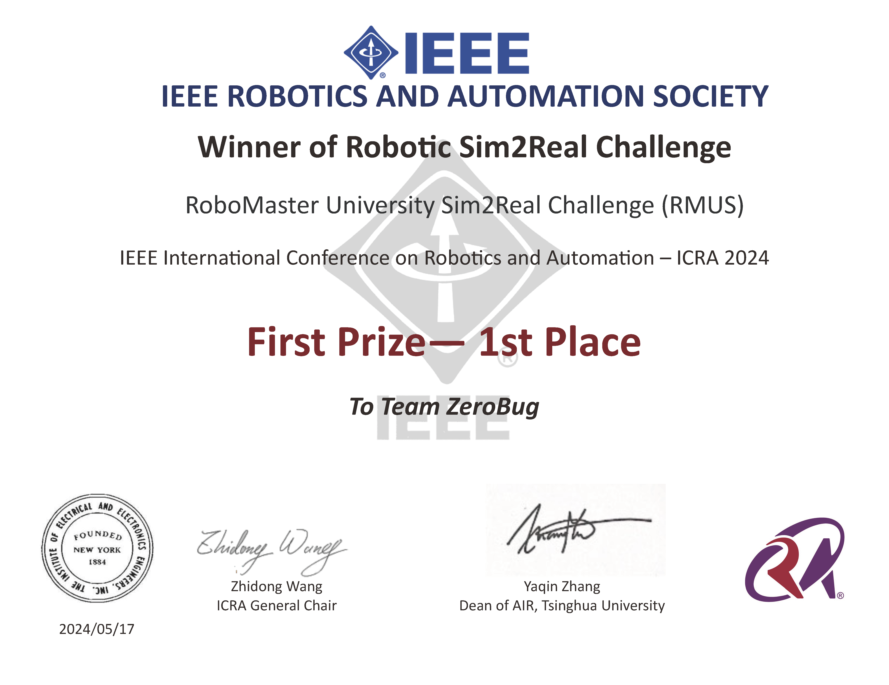

# RoboMaster University Sim2real Challenge-ZeroBug Team

## 1. Introduction of us and the competition

This is the official repository of Team ZeroBug, which took first place in 2024 RoboMaster University Sim2real Challenge (RMUS).



RMUS is the mineral searching task of [Robotic Sim2real Challenge](http://www.sim2real.net), hosted at ICRA 2024.

> The RoboMaster University Sim2Real Challenge (RMUS) at its core allows participants to win points by rearranging minerals using fully automated RoboMaster EPs that have been modified officially. The match lasts for five minutes with a sim2real-based format, where robots rearrange minerals based on the information shown on the exchange tags to earn points. The objective of the challenge is to assess how well a program completed on a simulation platform can be operated in real application environments. Participants will be ranked according to their total points won.

Basically, RMUS can be divided into two stages, i.e., simulation and real-world. In simulation stage, a standardized simulator developed on Habitat is provided. Afterwards, each team is required to perform sim-to-real transfer by submitting algorithms to the competition committee via Docker once per week and debugging with test-run logs and videos. After 8 rounds of debugging, the committee conducts three trials in the real robot to evaluate the algorithm of each team and ranks teams according to highest score.

For researchers interested in our paper *Robotic Sim-to-Real Transfer for Long-Horizon Pick-and-Place Tasks in the Robotic Sim2Real Competition*, refer to [contributions.md](./paper/contributions.md) for our contributions.

For engineers interested in technical details, refer to [techniques.md](./techniques.md) for explanation of each module.

## 2. Deployment

**Important!** We assume that you have basic knowledge of Docker and ROS. E.g. What are Docker images and containers? How to execute commands inside a Docker container? What are the node, topic and service in ROS? How to launch nodes with launch files? etc. Additionally, it's helpful to take good command of git if you'd like to check PID and open-loop controllers mentioned in our paper, which are used in early stage of the competition but removed later.

### 2.1 Docker Installation

To run our algorithms in RMUS simulation environment, you need to install `docker` and `nvidia docker`. Please follow the official document or use the following commands.

+ Docker

```bash
sudo apt-get install -y  apt-transport-https ca-certificates curl gnupg2 software-properties-common lsb-release
sudo apt-get update

curl -fsSL https://download.docker.com/linux/ubuntu/gpg | sudo apt-key add -

sudo add-apt-repository \
   "deb [arch=amd64] https://mirrors.tuna.tsinghua.edu.cn/docker-ce/linux/ubuntu \
   $(lsb_release -cs) \
   stable"

sudo apt-get update
sudo apt-get install -y  docker-ce
```

+ Nvidia docker

```bash
curl -fsSL https://nvidia.github.io/libnvidia-container/gpgkey | sudo gpg --dearmor -o /usr/share/keyrings/nvidia-container-toolkit-keyring.gpg \
&& curl -s -L https://nvidia.github.io/libnvidia-container/stable/deb/nvidia-container-toolkit.list | \
sed 's#deb https://#deb [signed-by=/usr/share/keyrings/nvidia-container-toolkit-keyring.gpg] https://#g' | \
sudo tee /etc/apt/sources.list.d/nvidia-container-toolkit.list

sudo apt-get update
sudo apt-get install -y nvidia-container-toolkit
```
### 2.2 ROS Core Image

You may pull the `ros core` image by running the following command:

```bash
docker pull ros:noetic-ros-core-focal
```

### 2.3 Simulator Image

You may pull the `simulator` image by running the following command:

```bash
docker pull rmus2022/server:result_pub_fix
```

Or you can run these commands if you have internet issues:

```bash
docker pull registry.cn-hangzhou.aliyuncs.com/rmus2024/server:result_pub_fix
docker tag registry.cn-hangzhou.aliyuncs.com/rmus2024/server:result_pub_fix rmus2022/server:result_pub_fix
```

### 2.4 Client Image

``` bash
docker pull registry.cn-hangzhou.aliyuncs.com/rmus2024/client:latest
```

### 2.5 Start the ROS Core

```bash
docker run -dit --name ros-master --network host ros:noetic-ros-core-focal roscore
```

### 2.6 Start the Server

```bash
docker run -dit --name sim-server --network host \
	--gpus all \
	-e DISPLAY=$DISPLAY \
 	-e QT_X11_NO_MITSHM=1 \
 	-e NO_AT_BRIDGE=1 \
 	-e LIBGL_ALWAYS_SOFTWARE=1 \
 	-e NVIDIA_DRIVER_CAPABILITIES=all \
 	-v /tmp/.X11-unix:/tmp/.X11-unix \
 	rmus2022/server:result_pub_fix
```

### 2.7 Start the Client

```bash
docker run -it --name client --network host \
	--cpus=5.6 -m 8192M \
	-e DISPLAY=$DISPLAY \
	-e QT_X11_NO_MITSHM=1 \
	-e NO_AT_BRIDGE=1 \
	-e LIBGL_ALWAYS_SOFTWARE=1 \
	-v /tmp/.X11-unix:/tmp/.X11-unix \
	registry.cn-hangzhou.aliyuncs.com/rmus2024/client:latest
```

## 3. License and Acknowledgement

The project is released under GPL 2.0 license. During the development of our algorithms, we draw inspirations from these projects:

[ICRA2024-Sim2Real-RM](https://github.com/AIR-DISCOVER/ICRA2024-Sim2Real-RM.git)

[ROS Motion Planning](https://github.com/ai-winter/ros_motion_planning)

[XJU robot project](https://github.com/Mr-Tony921/xju-robot.git)

[ROS Navigation Stack](https://github.com/ros-planning/navigation.git)

## 4. Contact

| Member        | Affiliation                                          | E-mail            |
| ------------- | ---------------------------------------------------- | ----------------- |
| Hongyu Cao    | Tianjin University                                   | 1274653465@qq.com |
| Ming Yang     | Institute of Automation, Chinese Academy of Sciences | 1308592371@qq.com |
| Lixuan Zhao   | Tianjin University                                   | 2196680698@qq.com |
| Chenrui Zhang | Tianjin University                                   | 2594881464@qq.com |

