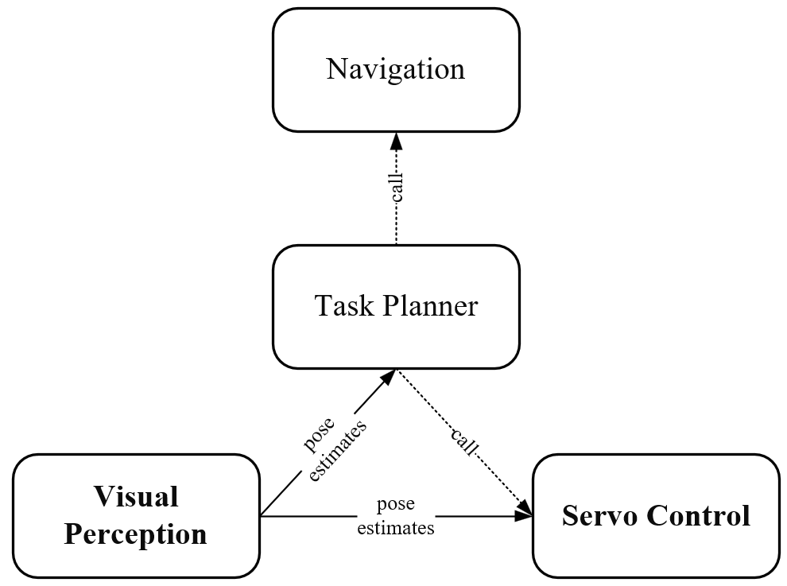
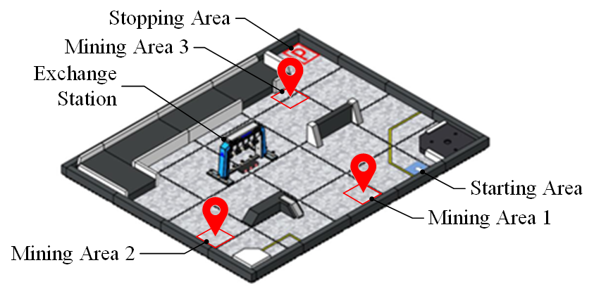

#  Techniques

## 1. Architecture

The algorithms can be divided into four modules, navigation, task planner, visual perception and servo control.



The navigation module comprises `navi_control.py`, which is a ROS node and calls `cartographer` to navigate.

The task planner comprises `play_game.py`, which is a ROS node and contains game logic.

The visual perception module comprises `img_processor.py`, `detect.py` and `simple_digits_classification/`. `img_processor.py` is a ROS node that subscribes sensor data (RGBD image) and publishes pose estimates. `detect.py` contains utility functions. `simple_digits_classification/` contains classifier's weight `model.pth`, training set `templates/` and training program `simple_digits_classify.py`.

The servo module comprises `manipulator.py` and `arm_ctrl.py`. `manipulator.py` is a ROS node that subscribe pose estimates and publish velocity to control the robot. `arm_ctrl.py` contains utility functions of arm control and chassis alignment.

```
rmus_solution
  └── scripts
      ├── arm_ctrl.py
      ├── detect.py
      ├── img_processor.py
      ├── manipulator.py
      ├── navi_control.py
      ├── play_game.py
      └── simple_digits_classification
          ├── model.pth
          ├── simple_digits_classify.py
          └── templates/
```

## 2. Details

### 2.1 Our algorithms

1. `navi_control.py`

   This file manages waypoints and keep-out areas, and provides a 'ROS Service' interface to navigate to waypoints and turn on/off keep-out areas.

2. `manipulator.py`

   This file provides 'ROS Service' interface for mineral grasping and stacking. The controller (implemented in `arm_ctrl.py`) is based on state-space model that applies feedback linearization to decouple position and attitude.

3. `img_processor.py`

   This file is responsible for the pose estimation of mineral and exchange markers and publishes the 'ROS Topic'.  Its pipeline (implemented in `detect.py`) is detection-classification-localization. We pixelate mineral and exchange markers and use [ArUco detector](https://docs.opencv.org/4.x/d5/dae/tutorial_aruco_detection.html) to extract their contours. Then we write a CNN-based classifier to assign each contour a label and use a PnP solver to estimate its pose. Subsequently, we apply low-pass filter to pose estimates and publish them.

4. `play_game.py`

   This file is responsible for the game logic.

   

   - The robot first sets the three mining areas as keep-out area (to prevent the navigation algorithm from traversing the mining area and colliding with minerals mineral), and goes to the `Exchange Station` to identify exchange markers, then remove the keep-out area, and goes to the `MiningArea0` (the mining area near the starting area) for observation. The mineral closest to the robot is selected for grasping.

   - In the grasping process, if the mineral is close to the wall, in order to avoid collision, the mineral surface with the smallest angle between the mineral and the wall is selected for angular alignment. If so, it will be placed in the `Exchange Station`. Else, it will be placed on the ground.

   - After placing the first mineral, the robot goes back to `Mining Area 0` to  do another grasp until no mineral left there.

   - The robot goes to `Mining Area 1` and `Mining Area 2` to repeat above actions. 

   - The robot retrieves minerals on the ground and stacks them in the `Exchange Station`.

   - The robot sets the three mining areas as keep-out area and goes to `Stopping Area`.

### 2.2 Used packages

1. rotate_recovery

   It's extracted from [ROS Navigation Stack](https://github.com/ros-planning/navigation/tree/noetic-devel/rotate_recovery), and we add timeout to it.


2. [straf_recovery](https://github.com/Bob-Eric/straf_recovery)

   It triggers customized recovery actions when the robot is stuck.
